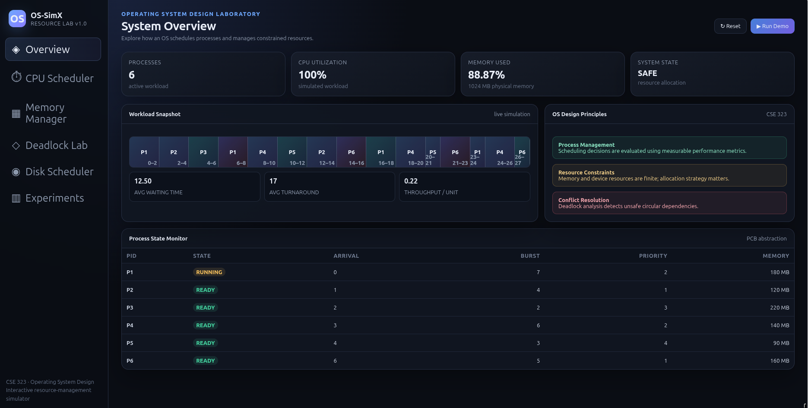
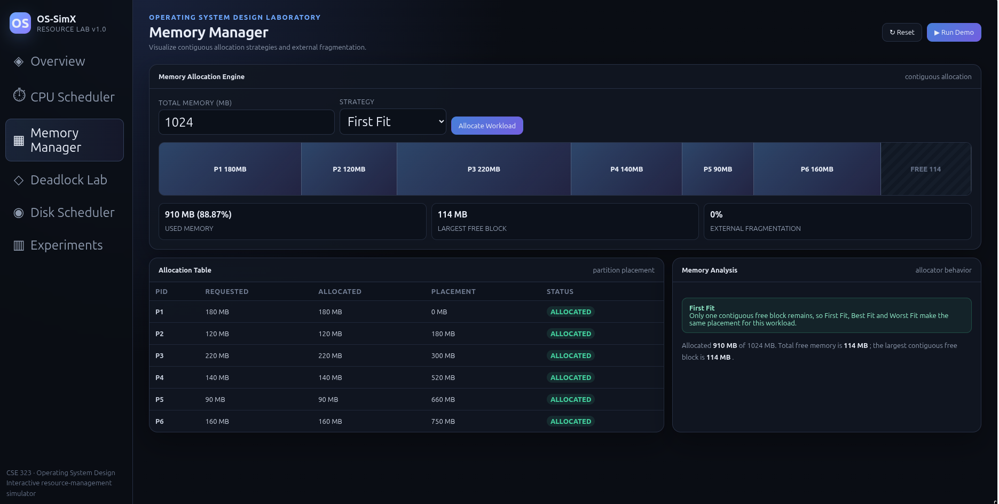
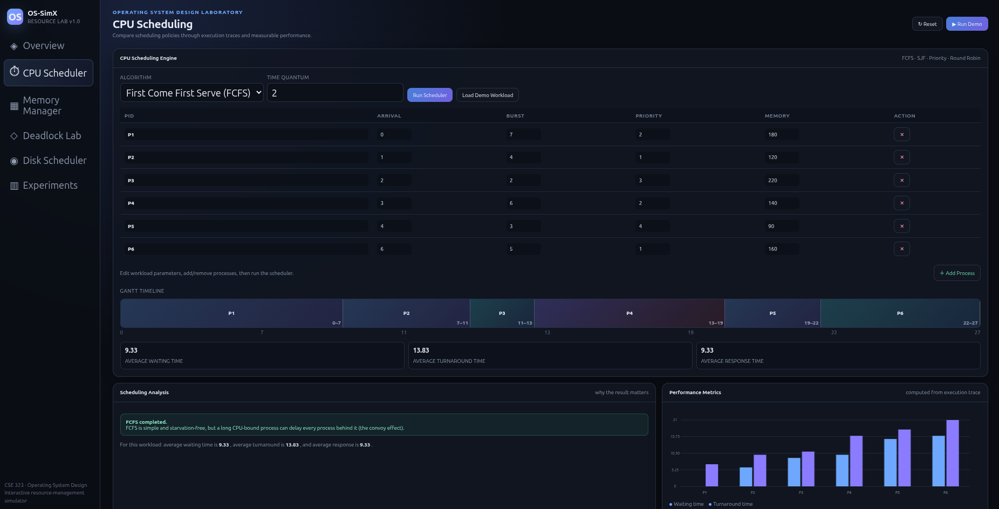
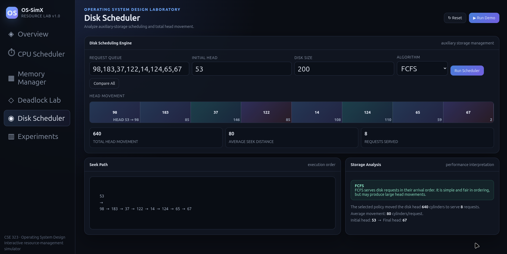
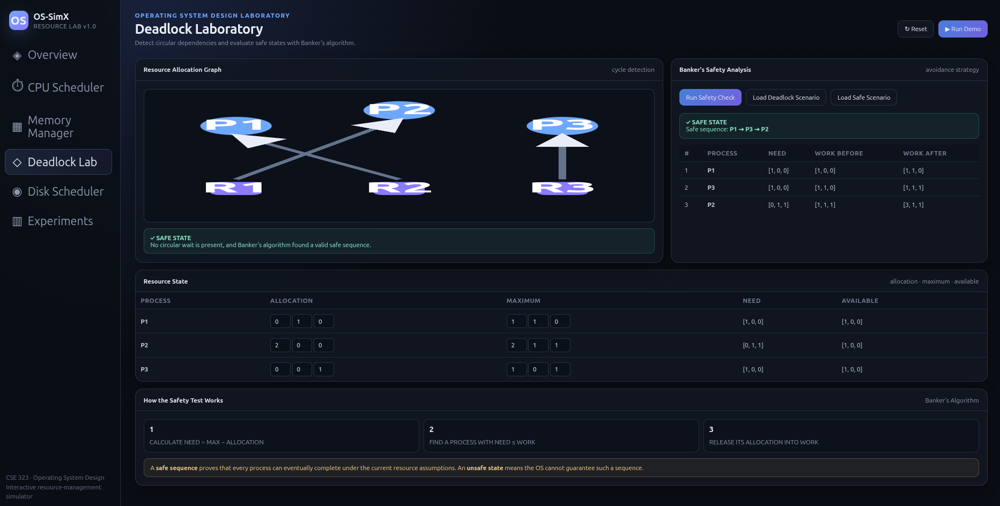
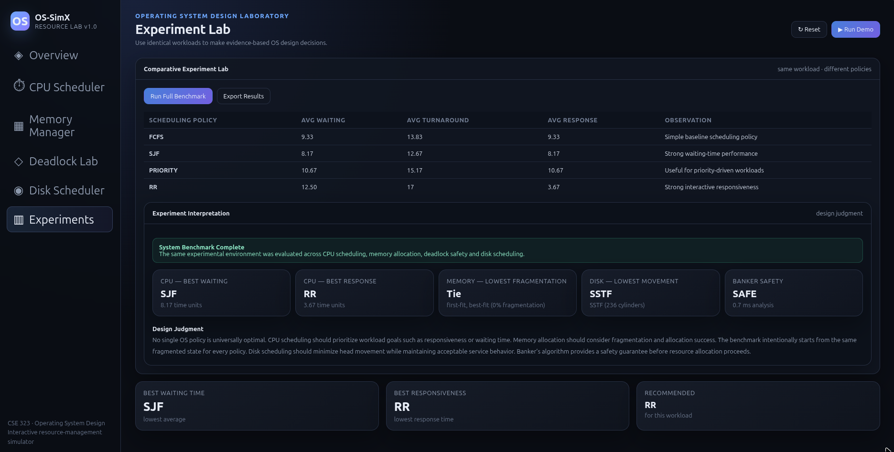

# OS-SimX — Interactive Operating System Resource Management & Performance Simulator

OS-SimX is an interactive web-based Operating System simulator designed to visualize and understand core OS resource management concepts through practical simulations.

## 🚀 Live Demo

**[Launch OS-SimX](https://atiqshahriar-ai.github.io/OS-SimX-Interactive-Operating-System-Resource-Management-Performance-Simulator/)**

## 🎥 Video Presentation

A short video demonstration of OS-SimX, including the major features, interactive simulations, and performance analysis.

▶️ **[Watch the Video Presentation on YouTube](https://youtu.be/aheoF2fjVXM)**

## 📌 Features

OS-SimX currently includes interactive simulations for:

- CPU Scheduling
- Memory Management
- Deadlock Detection & Avoidance
- Disk Scheduling
- File System Management
- Process Management
- System Resource Monitoring
- Performance Analysis

## 🧠 Operating System Concepts

The simulator demonstrates important Operating System concepts including:

### CPU Scheduling
- First Come First Serve (FCFS)
- Shortest Job First (SJF)
- Priority Scheduling
- Round Robin
- Gantt Chart visualization
- Waiting Time
- Turnaround Time
- Throughput

### Memory Management
- First Fit
- Best Fit
- Worst Fit
- Contiguous Memory Allocation
- External Fragmentation
- Memory utilization analysis

### Deadlock Management
- Resource Allocation Graph
- Circular Dependency Detection
- Banker's Algorithm
- Safe State Detection
- Unsafe State Detection
- Safe Sequence Analysis

### Disk Scheduling
- Disk scheduling algorithms
- Head movement visualization
- Performance comparison

### File System
- File and directory management
- File allocation concepts
- Storage organization

## 🛠️ Technologies

- HTML5
- CSS3
- JavaScript
- GitHub Pages

No external backend or database is required.

## 📸 Screenshots

### 🖥️ Dashboard


### 🧠 Memory Management


### ⚙️ CPU Scheduling


### 💿 Disk Scheduling


### 🔒 Deadlock Management


### 🧪 Experiment Lab


## ▶️ Running Locally

Clone the repository:

```bash
git clone https://github.com/atiqshahriar-ai/OS-SimX-Interactive-Operating-System-Resource-Management-Performance-Simulator.git
